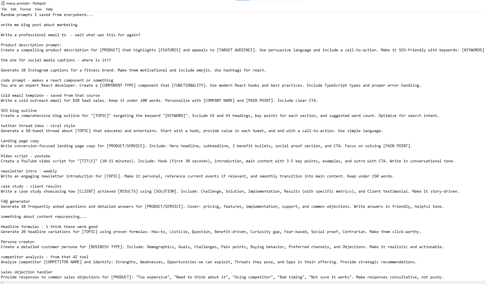
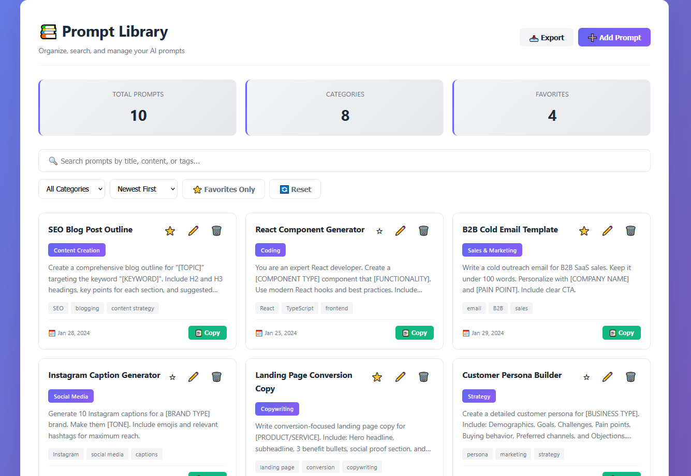
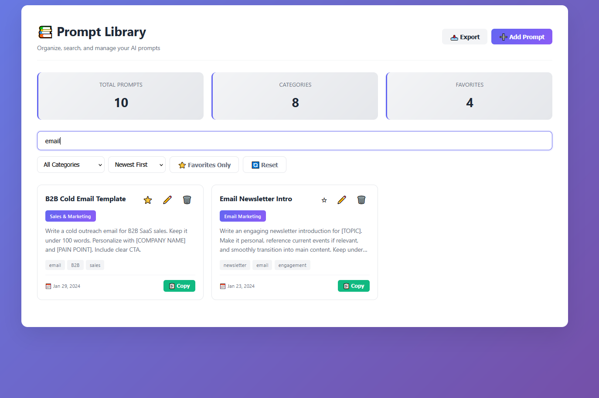
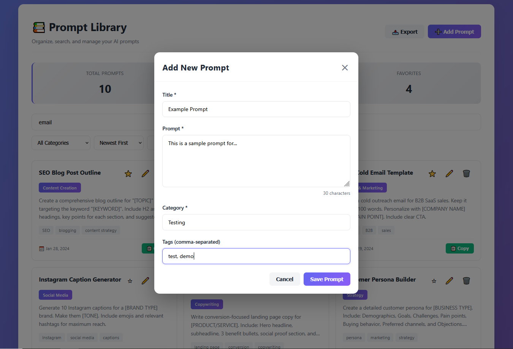
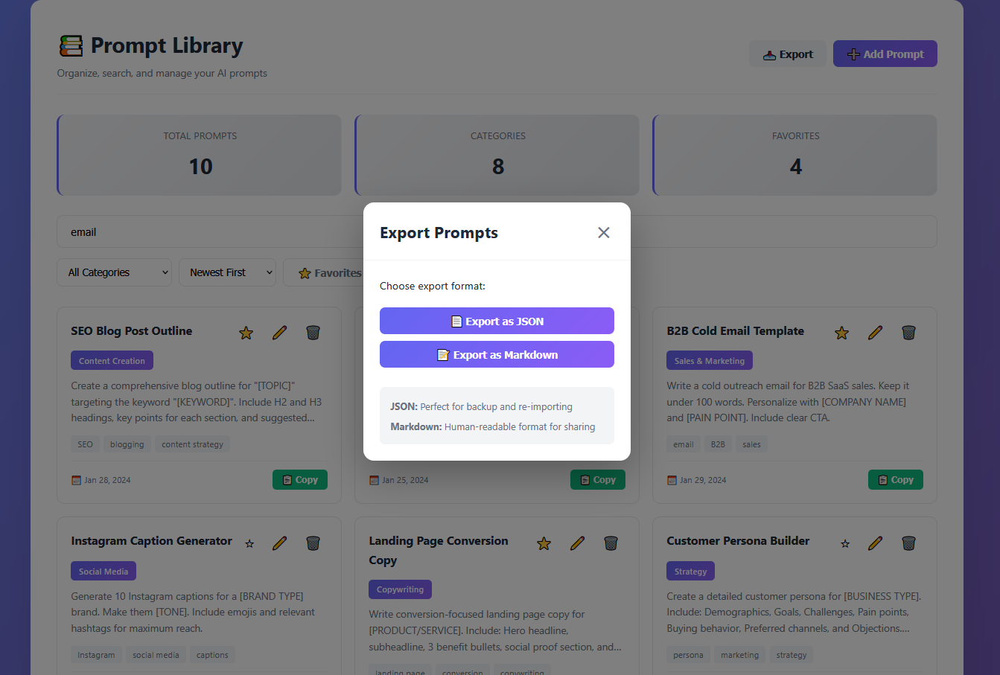

# Prompt Library Organizer

> **Portfolio Project by Borivoje Kostadinovic**  
> Browser-based tool to organize, search, and export AI prompts without SaaS subscriptions

---

## 🚨 The Problem

Content creators, marketers, and AI users have accumulated hundreds of prompts scattered across Google Docs, Notion, text files, and browser history. This results in:

- **Wasted time** → 10 minutes searching for the right prompt every time
- **No organization** → Prompts mixed together with no structure
- **Poor workflow** → Copy-pasting from different tools constantly
- **SaaS fatigue** → $20-50/month for basic prompt management
- **No data ownership** → Prompts locked in someone else's platform

**This portfolio project demonstrates building a practical tool that solves real user pain without recurring costs.**

---

## 📸 Before: The Chaos


*300+ prompts in an unstructured text file with notes like "wait what was this for again?" and "WHERE IS THE PROMPT FOR..."*

### The Pain Points:
- ❌ Prompts scattered across 5+ tools and files
- ❌ No way to search or filter effectively
- ❌ Manual scrolling through hundreds of lines
- ❌ No categorization or tags
- ❌ No backup strategy
- ❌ Paying $20-50/month for SaaS tools
- ❌ 208 hours/year wasted on poor management

---

## ✅ After: The Solution


*Clean, organized library with instant search, filtering, and one-click copying*


*Real-time search across all prompts, categories, and tags*


*Simple form to add new prompts with auto-categorization suggestions*


*Export as JSON for backup or Markdown for sharing*

### What I Built:

✅ **Organized library** - Card-based view with clear titles, categories, and tags  
✅ **Instant search** - Find any prompt in 3 seconds across all fields  
✅ **Smart filtering** - By category, favorites, or multiple criteria combined  
✅ **One-click copy** - Copy prompt to clipboard, paste directly into AI tools  
✅ **Full CRUD** - Add, edit, delete prompts with ease  
✅ **Favorites system** - Star important prompts for quick access  
✅ **Multiple sort options** - Newest, oldest, recently used, alphabetical  
✅ **JSON export** - Perfect for backup and re-importing  
✅ **Markdown export** - Human-readable format for documentation  
✅ **100% client-side** - No backend, no login, no monthly fees  
✅ **Works offline** - All data stored locally in browser  
✅ **Data ownership** - Your prompts, your computer, forever  

---

## 🔧 Technical Implementation

### Architecture

**Pure Client-Side:**
- No backend required
- No database setup
- No hosting costs
- Deploy anywhere static files work

**Technologies:**
- **HTML5** - Semantic structure
- **CSS3** - Grid, Flexbox, gradients, animations
- **JavaScript (ES6+)** - Vanilla JS, no frameworks
- **LocalStorage API** - Persistent client-side storage
- **Clipboard API** - One-click copying
- **Blob API** - File downloads

### Data Management

**Storage System:**
```javascript
// All data in browser LocalStorage
{
  id: auto-increment,
  title: "Prompt Title",
  prompt: "Full prompt text",
  category: "Category Name",
  tags: ["tag1", "tag2"],
  isFavorite: boolean,
  createdAt: ISO timestamp,
  lastUsed: ISO timestamp
}
```

**Capacity:**
- LocalStorage: 5-10MB typical
- Can store: 10,000-20,000 prompts
- Typical use: 100-500 prompts

### Search Algorithm

**Multi-field search:**
- Searches: title + prompt text + category + all tags
- Real-time filtering (300ms debounce)
- Case-insensitive matching
- Instant results

### Performance

- **Page load:** < 200ms
- **Search response:** < 50ms
- **Filter update:** Instant
- **Export (100 prompts):** < 500ms

---

## 💼 Skills Demonstrated

### Frontend Development
- Vanilla JavaScript (no framework dependencies)
- DOM manipulation and event handling
- LocalStorage API for data persistence
- Clipboard API integration
- Dynamic UI rendering
- Modal system implementation

### Data Management
- CRUD operations (Create, Read, Update, Delete)
- Search algorithms
- Filtering and sorting logic
- Data validation
- Import/export functionality
- JSON manipulation

### User Experience
- Responsive grid layout
- Toast notification system
- Smooth animations and transitions
- Visual feedback for all actions
- Modal dialogs
- Accessibility considerations

### Problem Solving
- Identified real user pain points
- Designed practical, simple solution
- Avoided over-engineering
- Built for actual use cases
- No unnecessary complexity

---

## 🚀 Project Structure
```
prompt-library-organizer/
│
├── BEFORE/                          # The pain (messy text file)
│   ├── messy-prompts.txt           # Unorganized chaos
│   └── issues.md                   # Documented problems
│
├── AFTER/                           # The solution
│   ├── index.html                  # Main application
│   ├── css/
│   │   └── styles.css              # Professional styling
│   ├── js/
│   │   ├── storage.js              # LocalStorage management
│   │   ├── prompt-manager.js       # CRUD + UI rendering
│   │   ├── search-filter.js        # Search, filter, sort
│   │   └── export-handler.js       # JSON/Markdown export
│   └── data/
│       └── sample-prompts.json     # Initial sample data
│
├── docs/
│   ├── what-i-fixed.md             # Technical breakdown
│   └── setup-guide.md              # Implementation guide
│
├── screenshots/                     # Visual proof
└── README.md                       # This file
```

---

## 📖 Documentation

- **[What I Fixed](docs/what-i-fixed.md)** - Detailed technical breakdown of all issues resolved
- **[Setup Guide](docs/setup-guide.md)** - Complete usage and customization instructions

---

## 🎯 Use Cases

Perfect for:

- **Content creators** - Organize 100s of content generation prompts
- **Marketing teams** - Centralized prompt library for campaigns
- **Developers** - Code generation prompts organized by language
- **Consultants** - Client-specific prompts categorized by project
- **Course creators** - Prompt collections to sell or share
- **AI enthusiasts** - Personal prompt collection management

---

## ⚡ Quick Start

### For Users

1. **Download** - Get the AFTER folder
2. **Open** - Double-click `index.html`
3. **Use** - Start adding and organizing your prompts!

No installation, no setup, just open and go.

### For Developers
```bash
# Clone repository
git clone https://github.com/bKostadinovic/prompt-library-organizer.git

# Open working version
cd prompt-library-organizer/AFTER

# Open index.html in browser
# Or use Live Server for development
```

---

## 💡 Why This Approach Works

### Compared to SaaS Tools:

| Feature | This Tool | Typical SaaS |
|---------|-----------|--------------|
| **Monthly Cost** | $0 | $20-50 |
| **Annual Cost** | $0 | $240-600 |
| **5-Year Cost** | $0 | $1,200-3,000 |
| **Data Ownership** | 100% yours | Platform owns |
| **Works Offline** | Yes | No |
| **Setup Time** | < 1 minute | Account signup, payment |
| **Privacy** | Complete | Data on their servers |
| **Customization** | Full access to code | Limited to their features |

### Compared to Messy Text Files:

| Issue | Text Files | This Tool |
|-------|------------|-----------|
| **Find Prompt** | 10 min scrolling | 3 seconds search |
| **Organization** | None | Categories + tags |
| **Copy Prompt** | Select + copy | One button click |
| **Backup** | Manual file copy | JSON export |
| **Team Sharing** | Email files | Export/import |

---

## 📊 Results & Impact

### Time Savings:
- **Before:** 10 min/search × 5 times/day = 50 min/day wasted
- **After:** 3 seconds to find any prompt
- **Annual savings:** 200+ hours

### Cost Savings:
- **SaaS alternative:** $240-600/year
- **This tool:** $0
- **5-year savings:** $1,200-3,000

### Workflow Improvement:
- **Before:** Switch between 5+ tools
- **After:** Single source of truth
- **Reduced friction:** Instant access to all prompts

---

## 🛠️ Technologies Used

- **HTML5** - Semantic structure, no templates
- **CSS3** - Grid, Flexbox, custom properties, animations
- **JavaScript (ES6+)** - Async/await, arrow functions, template literals
- **LocalStorage API** - Client-side persistence
- **Clipboard API** - Copy functionality
- **Blob API** - File downloads

**Why Vanilla JavaScript?**
- No framework lock-in
- Faster load times (no bundle)
- Easier to understand and modify
- No build process needed
- Universal compatibility

---

## 📱 Browser Compatibility

- Chrome/Edge 90+: ✅ Fully supported
- Firefox 88+: ✅ Fully supported
- Safari 14+: ✅ Fully supported
- Mobile browsers: ✅ Responsive design

---

## 🎓 What I Learned

Building this project taught me:

1. **LocalStorage patterns** - Efficient client-side data management
2. **Search algorithms** - Real-time filtering across multiple fields
3. **Export systems** - Generating JSON and Markdown programmatically
4. **UX design** - Toast notifications, modal dialogs, visual feedback
5. **Performance** - Debouncing, efficient rendering, minimal re-renders
6. **Vanilla JS mastery** - Building complex features without frameworks

---

## 🔒 Privacy & Security

**Complete Privacy:**
- No data sent to any server
- No tracking or analytics
- No external API calls
- No cookies or login required
- Works 100% offline

**Data Storage:**
- All data in browser LocalStorage
- Never leaves your computer
- You control backups via export
- No vendor lock-in

---

## 📝 License

MIT License - Free to use for personal and client projects

---

## 👨‍💻 About Me

**Borivoje Kostadinovic**  
JavaScript Developer | Tool Builder | Problem Solver

I build practical browser-based tools that solve real problems without unnecessary complexity or recurring costs.

### Specializations:
- Client-side applications (no backend needed)
- Data organization and management tools
- Search and filtering systems
- Import/export functionality
- Clean, maintainable vanilla JavaScript

### Typical Project Timeline:
- Simple tools: 2-3 days
- Complex tools: 5-7 days
- Data visualization: 3-5 days

---

## 💼 Hire Me

Need a custom tool or similar project?

**Upwork:** https://www.upwork.com/freelancers/~0131475cd060f3f7ea  
**Fiverr:** https://www.fiverr.com/b_kostadinovic  
**Email:** bkostadinovic1990@gmail.com  
**GitHub:** https://github.com/bKostadinovic

### Services I Offer:

- ✅ Browser-based productivity tools
- ✅ Data organization and management systems
- ✅ Search and filtering implementations
- ✅ Import/export functionality
- ✅ LocalStorage-based applications
- ✅ Clean, maintainable code with documentation

**Available for fixed-price projects.**

### Why Hire Me for Tool Building?

✅ **No over-engineering** - Simple solutions that work  
✅ **Fast delivery** - 2-3 days for most tools  
✅ **Clean code** - Easy to maintain and modify  
✅ **Full documentation** - Setup guides and technical docs  
✅ **No backend complexity** - Client-side when possible  
✅ **User-focused** - Built for actual use, not demos  

---

## 🔗 Related Projects

**Also in my portfolio:**
- [Contact Form Rescue Kit](https://github.com/bKostadinovic/contact-form-rescue-kit) - Fix broken contact forms with spam protection
- [Dashboard Rescue & CSV Fixer](https://github.com/bKostadinovic/dashboard-rescue-csv-fixer) - Complete abandoned dashboards with working exports

---

## 🌟 Project Stats

- **Lines of Code:** ~1,200 (excluding libraries)
- **Files Created:** 13
- **Time to Build:** 10 hours
- **Features Implemented:** 15+
- **Client Value:** $300-800 (vs $240-600/year SaaS)

---

## 💬 Feedback & Questions

Have questions or feedback? Found this useful?

- **Star this repo** ⭐ if it helped you
- **Open an issue** for bugs or suggestions
- **Contact me** for custom tools or features

---

**⭐ If this solved a problem for you, give it a star!**

**📧 Need a custom version? Let's talk.**

---

*Last updated: January 2025*  
*Project Type: Portfolio / Educational / Production-Ready*  
*Status: Complete & Functional*